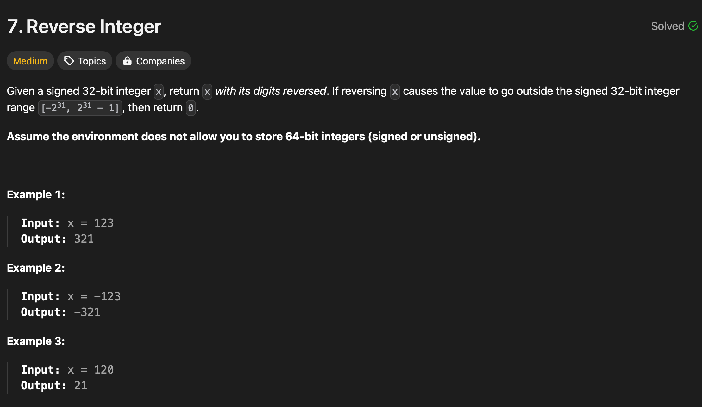

# LeetCode Practice Problem's Solution

## Reverse Integer

### Solution
__CPP__
```CPP
class Solution
{
public:
    int reverse(int x)
    {

        int ans = 0;
        int digit;
        while (x != 0)
        {
            digit = x % 10;

            if ((ans > INT_MAX / 10) || (ans < INT_MIN / 10))
            {
                return 0;
            }
            ans = (ans * 10) + digit;
            x = x / 10;
        }
        return ans;
    }
};
```
__JS__
```JavaScript
class Solution {
    reverse(x) {
        let ans = 0;
        let digit;
        while (x !== 0) {
            digit = x % 10;

            if ((ans > Number.MAX_SAFE_INTEGER / 10) || (ans < Number.MIN_SAFE_INTEGER / 10)) {
                return 0;
            }
            ans = (ans * 10) + digit;
            x = Math.floor(x / 10);
        }
        return ans;
    }
}

let s = new Solution();
let num = 76345;
console.log("Actual Number: ", num);
console.log("Reversed: ", s.reverse(num));
```